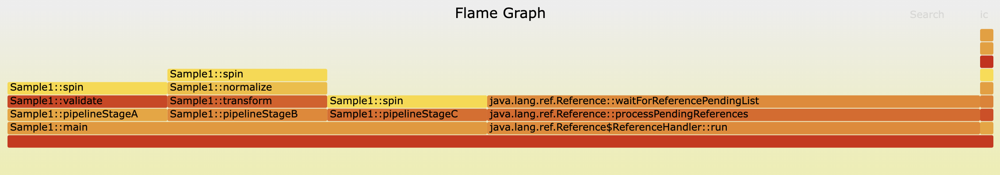
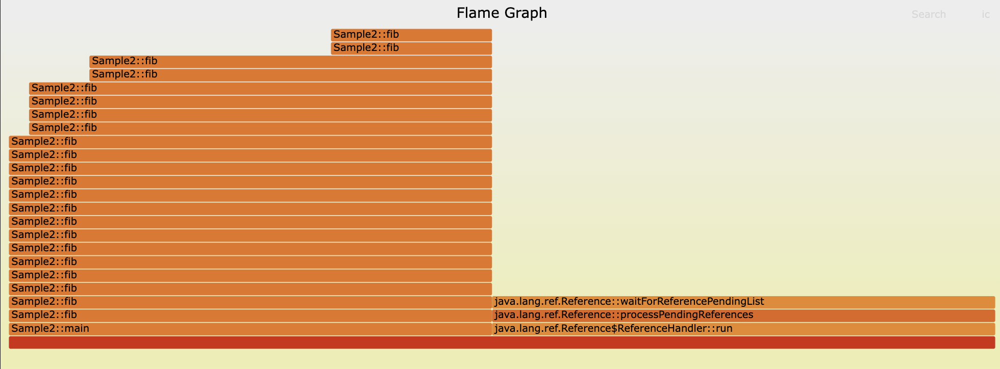
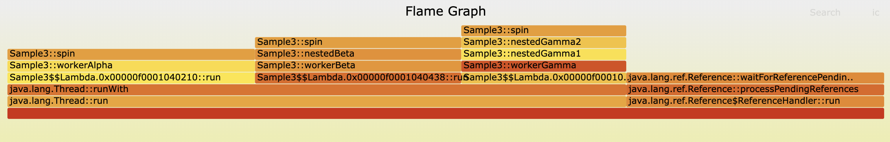

# C++ JVMTI Java Profiler

A custom Java profiler built from scratch in C++ using the JVM Tool Interface (JVMTI). This project is built incrementally, focusing on low-overhead, thread-safe native profiling.

Here are some examples of the outputs:
#### Sample 1


#### Sample 2


#### Sample 3



## Prerequisites
* C++17 compatible compiler (Clang/GCC/MSVC)
* CMake (>= 3.10)
* Java Development Kit (JDK 8+)
* `JAVA_HOME` environment variable set.

## Build Instructions
```bash
mkdir build && cd build
cmake ..
cmake --build .
```

## Run Instructions
```bash
# Compile your test Java code
javac test/Main.java

# Run with the agent attached (macOS/Linux); build output is javaplusplus.dylib/.so
java -agentpath:./build/javaplusplus.dylib=logpath=/tmp/profiler.log,jsonpath=/tmp/profiler.json,flamepath=/tmp/profiler.folded -cp test Main
```

Agent options (comma-separated `key=value`, all optional):
- `logpath=` — file the `Logger` appends to, in addition to stderr.
- `jsonpath=` — where `Reporter::dump_json` writes method stats + thread summaries on `VMDeath`.
- `flamepath=` — where `Reporter::dump_folded_stacks` writes a collapsed-stack file (`Class::method;Class::method;... count` per line) directly consumable by `flamegraph.pl` / speedscope.

### Additional Notes
- Using GLM to help scope and plan this out.
- Some of the CPP might be questionable lol
- perl script was found online to generate the flame graphs 
